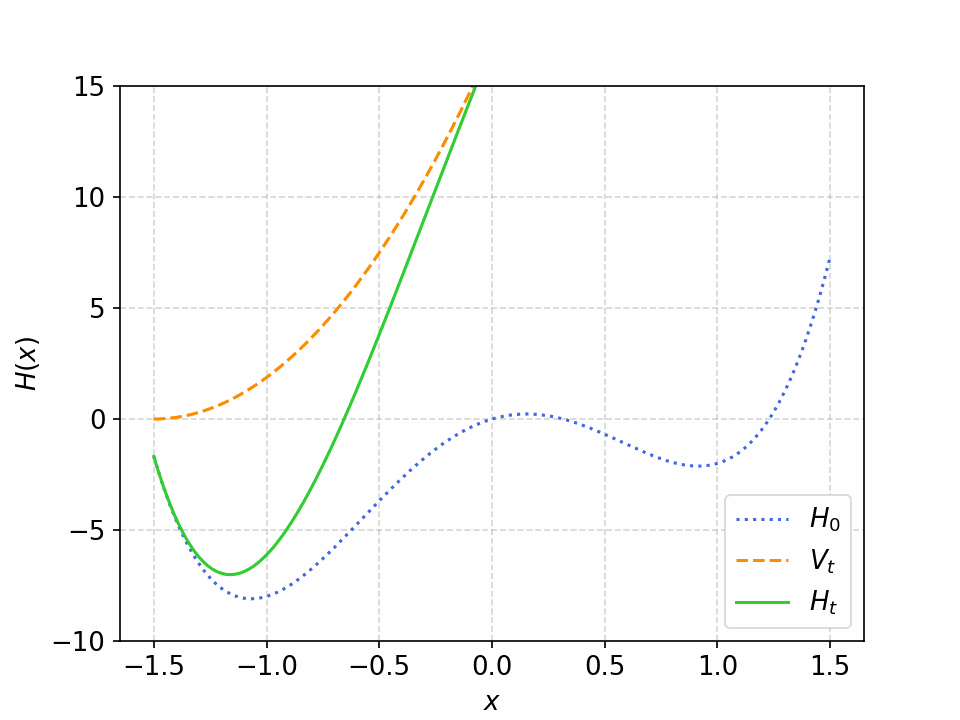
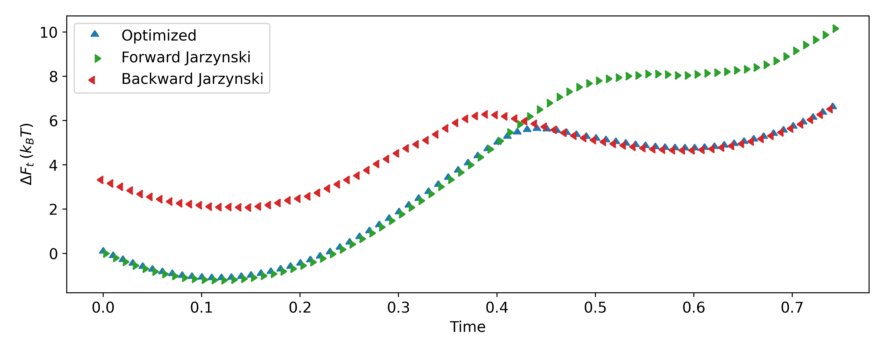

<h1 align="center">Physics of Complex Systems - PoD  University of Padua   2023/2024</h1>

  
   
  

# Optimized Free Energies from Bidirectional Single-Molecule Force Spectroscopy

<h3 align="center"><b>Authors: </b>David D. L. Minh and Artur B. Adib </h3>

<h3 align="center"><b>Presentation by: </b>Riccardo Tancredi </h3>
<h3 align="center"><b>Date: </b>15/07/2024 </h3>

## Overview

This work explores the calculation of path-ensemble averages via processes in both forward and backward directions, leading to bidirectional expressions for free energies and the potential of mean force (PMF) from single-molecule force spectroscopy experiments. The bidirectional methods show better performance compared to unidirectional methods.

### Crooks’ Path-Ensemble Average Theorem

- **Link between non-equilibrium statistical mechanics and equilibrium ensemble averages:**
  - **Experiments:** Single-molecule pulling experiments using optical tweezers.
  - **Simulations:** Brownian dynamics simulation on an N-dimensional harmonic potential.

- **Exponential work averages:**
  - Dominated by rare events.
  - Weighted analysis includes trajectories from the reverse process as time-reversed counterparts of rare trajectories.

- **Theorem:** Relates the forward average of a functional of the space trajectory to its work-weighted average in the reverse process.

### Weighted Histogram Analysis Method (WHAM)

- **Purpose:** Find the least variance estimator for a desired PDF from a series of independent biased distributions.
- **Application:** Combines forward and reverse distributions effectively to minimize variance.

### Jarzynski’s Equality

- Relates the free energy difference between two states to the irreversible work along an ensemble of trajectories joining the same states.

### Bennet Acceptance Ratio (BAR) Formula

- **Formula:** An implicit equation for estimating free energy differences.
- **Optimization:** Minimizes the average squared error of the free energy estimate using a Newton–Raphson solver.

## Simulated System

In single molecule pulling experiments, the system is driven out of equilibrium by a time-dependent potential $V(x, t)$ acting on a global coordinate $x$ such as the end-to-end distance of a molecule or protein.

The total Hamiltonian is given by:

$$
\begin{equation*}
  H(x, t) = H_0(x) + V(x, t)
\end{equation*}
$$

**Simulation Details:**
- Brownian simulation on a one-dimensional potential.
- The center of the potential trap is varied linearly from -1.5 to 1.5 in the forward direction and from 1.5 to -1.5 for reverse trajectories.

**Overdamped Langevin Equation Integrator:**

$$
\begin{equation*} 
  x_{i+1} = x_i + f(x_i) \Delta t + \sqrt{2D \Delta t} \xi_i 
\end{equation*}
$$

where $f(x_i)$ is the force at time $t_i$, $D$ is the diffusion coefficient, and $\xi_i$ is a random Gaussian number sampled from $\mathcal{N}(0, 1)$.

## Bidirectional Estimator for $\Delta F_t$

Using the Crooks' fluctuation theorem and the **BAR** method, the bidirectional estimator for the free energy difference is derived.

The BAR method helps estimate the total free energy difference, providing accurate and optimized results.

## Potential of Mean Force (PMF)

The **PMF** $G_0(x)$ in the absence of the external potential is obtained from the equilibrium distribution. The equilibrium distribution of $x$ values is given by:

$$
\begin{equation*}
  \rho_0(x) \propto \exp(-\beta G_0(x))
\end{equation*}
$$

Using the **WHAM** method, combining estimates at different positions, we obtain the Hummer-Szabo estimator for $G_0(x)$.

## Conclusions

- Unidirectional estimates are strongly biased as points considered at time *t* are not at equilibrium.
- The bidirectional method allows proper weighting of forward and backward contributions, leading to more accurate PMF reconstructions.
- The PMF reconstruction method outperforms unidirectional methods, providing correct estimates even far from the equilibrium state.

## References

1. Minh, D. D. L., & Adib, A. B. (2008). Optimized free energies from bidirectional single-molecule force spectroscopy. *Physical Review Letters, 100*(18), 180602.
2. Hummer, G., & Szabo, A. (2010). Free energy profiles from single-molecule pulling experiments. *Proceedings of the National Academy of Sciences, 107*(50), 21441-21446.
3. Chipot, C., & Pohorille, A. (2007). Free energy calculations (Vol. 86, pp. 203-209). Berlin: Springer.
4. Nicolini, P. P., Procacci, P., & Chelli, R. (2010). Hummer and Szabo-like potential of mean force estimator for bidirectional nonequilibrium pulling experiments/simulations. *The Journal of Physical Chemistry B, 114*(29), 9546-9554.

---
